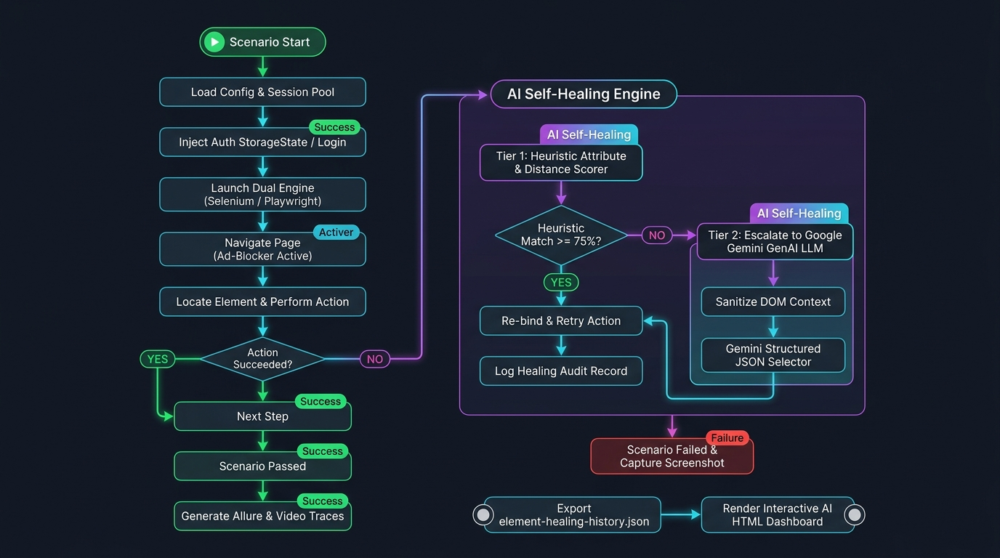

# 🎭 DemoQA Playwright Consumer Test Automation Project

A production-ready, standalone Behavior-Driven Development (BDD) test automation project automating **DemoQA** using **Microsoft Playwright for Java** powered by the **AI-Powered Test Automation Framework Core SDK** (`com.automation:ai-automation-framework:1.0.0`).

> **True Universal Automation**: This project demonstrates how the Core SDK seamlessly powers modern **Playwright for Java** test suites, sharing the exact same multi-provider AI self-healing backend, test data management, and centralized telemetry server.

---

## 📋 Table of Contents
1. [Overview & Architecture](#1-overview--architecture)
2. [Included Playwright Feature Suites](#2-included-playwright-feature-suites)
3. [Prerequisites & SDK Installation](#3-prerequisites--sdk-installation)
4. [How to Author Playwright Tests with the Core SDK](#4-how-to-author-playwright-tests-with-the-core-sdk)
5. [Running Tests Locally & CLI Options](#5-running-tests-locally--cli-options)
6. [AI Self-Healing in Playwright Engine](#6-ai-self-healing-in-playwright-engine)
7. [Reports & Centralized Telemetry Dashboard](#7-reports--centralized-telemetry-dashboard)
8. [Playwright Observability: Video Recording & Execution Tracing](#8-playwright-observability-video-recording--execution-tracing)
9. [Window Sizing, Headed Mode & Full-Screen Maximization](#9-window-sizing-headed-mode--full-screen-maximization)
10. [Configuration Properties Reference](#10-configuration-properties-reference)
11. [Troubleshooting & Frequently Asked Questions (FAQ)](#11-troubleshooting--frequently-asked-questions-faq)

---

## 1. Overview & Architecture

This project writes **zero browser boilerplate or driver setup code**. All core capabilities:
- **Thread-safe Playwright session lifecycle** (`PlaywrightManager`) across Chromium, Firefox, and WebKit.
- **Universal DOM Intelligence Crawler** (`PlaywrightDOMAnalyzer`) evaluating candidates in $< 15\text{ms}$.
- **Automatic AI Self-Healing** (`PlaywrightLocatorHealer`) on `TimeoutError` / `PlaywrightException`.
- **Zero-Model Test Data Management (TDM)** (`TestDataManager`, `DataGenerator`, `ScenarioContext`).
- **Centralized Telemetry Dashboard integration** streaming execution records to Web Control Center on port `8080`.

are inherited directly from the Core SDK declared in `pom.xml`:

```xml
<dependencies>
    <!-- AI-Powered Test Automation Framework Core SDK -->
    <dependency>
        <groupId>com.automation</groupId>
        <artifactId>ai-automation-framework</artifactId>
        <version>1.0.0</version>
    </dependency>

    <!-- Microsoft Playwright Java -->
    <dependency>
        <groupId>com.microsoft.playwright</groupId>
        <artifactId>playwright</artifactId>
        <version>1.45.0</version>
    </dependency>
</dependencies>
```

### 🏛️ Platform Architecture Diagram


### 🔄 Test Execution Lifecycle & AI Self-Healing Flowchart



---

## 2. Included Playwright Feature Suites

| # | Feature File | Target Page URL | Page Object | Tags | Key Capabilities Demonstrated |
| :- | :--- | :--- | :--- | :--- | :--- |
| 1 | **`01_PlaywrightTextBox.feature`** | `/text-box` | `PlaywrightTextBoxPage` | `@TextBox`, `@Smoke` | Form filling (Full Name, Email, Address), submit button click, and output card verification. |
| 2 | **`02_PlaywrightButtons.feature`** | `/buttons` | `PlaywrightButtonsPage` | `@Buttons`, `@Smoke` | Dynamic click buttons, DOM auto-waiting, and success message text assertion. |
| 3 | **`03_PlaywrightAISelfHealing.feature`** | `/text-box` | `PlaywrightTextBoxPage` | `@SelfHealing` | Injected broken selector (`invalid_broken_playwright_username_99999`) auto-healed in real-time. |
| 4 | **`04_PlaywrightCheckBox.feature`** | `/checkbox` | `PlaywrightCheckBoxPage` | `@CheckBox`, `@Elements` | Tree node expansion, hierarchical checkbox selection, and result verification. |
| 5 | **`05_PlaywrightRadioButton.feature`** | `/radio-button` | `PlaywrightRadioButtonPage` | `@RadioButton`, `@Elements` | Dynamic radio button selections (`Yes`, `Impressive`) and status assertions. |
| 6 | **`06_PlaywrightWebTables.feature`** | `/webtables` | `PlaywrightWebTablesPage` | `@WebTables`, `@Elements` | Real-time search filter and React table row assertions. |
| 7 | **`07_PlaywrightAlerts.feature`** | `/alerts` | `PlaywrightAlertsPage` | `@Alerts`, `@AlertsWindows` | Browser JavaScript alert and confirmation dialog handling via `page.onceDialog`. |
| 8 | **`08_PlaywrightSelectMenu.feature`** | `/select-menu` | `PlaywrightSelectMenuPage` | `@SelectMenu`, `@Widgets` | HTML `<select>` option selection and active option verification. |

---

## 3. Prerequisites & SDK Installation

### System Requirements
* **Java JDK**: JDK 17 LTS or 21 LTS (`java -version`)
* **Apache Maven**: 3.8.0+ (`mvn -version`)
* **Playwright Browsers**: Automatically managed by Playwright or installed via `mvn exec:java -e -D exec.mainClass=com.microsoft.playwright.CLI -D exec.args="install"`

### 🔑 SDK Dependency Availability

#### Option A: GitHub Packages (Recommended Cloud Distribution)
Configure your `~/.m2/settings.xml` (Windows: `C:\Users\<user>\.m2\settings.xml`):
```xml
<settings>
  <servers>
    <server>
      <id>github</id>
      <username>YOUR_GITHUB_USERNAME</username>
      <password>${env.GITHUB_TOKEN}</password>
    </server>
  </servers>
</settings>
```
Declare the repository in `pom.xml`:
```xml
<repositories>
    <repository>
        <id>github</id>
        <name>GitHub Packages</name>
        <url>https://maven.pkg.github.com/Parvez414/ai-powered-test-automation-platform</url>
    </repository>
</repositories>
```

#### Option B: Local JAR Installation (Offline)
```bash
mvn clean install -DskipTests
```

---

## 4. How to Author Playwright Tests with the Core SDK

### Step 1: Create Page Objects Extending `PlaywrightBasePage`
```java
package com.demoqa.playwright.pages;

import com.automation.playwright.PlaywrightBasePage;
import com.automation.playwright.PlaywrightPageElement;

public class MyPlaywrightPage extends PlaywrightBasePage {

    public PlaywrightPageElement searchInput;
    public PlaywrightPageElement submitBtn;

    public MyPlaywrightPage() {
        super("MyPlaywrightPage");
    }

    @Override
    protected void initElements() {
        searchInput = register("searchInput", "Main search text field", "input[name='q']");
        submitBtn = register("submitBtn", "Search submit button", "button[type='submit']");
    }

    public void search(String query) {
        fill(searchInput, query);
        click(submitBtn);
    }
}
```

### Step 2: Implement Cucumber Step Definitions
```java
package com.demoqa.playwright.stepdefinitions;

import com.demoqa.playwright.pages.MyPlaywrightPage;
import io.cucumber.java.en.When;

public class MyStepDefinitions {
    private final MyPlaywrightPage page = new MyPlaywrightPage();

    @When("user searches for {string}")
    public void userSearches(String query) {
        page.search(query);
    }
}
```

---

## 5. Running Tests Locally & CLI Options

### Run All Playwright Tests
```bash
mvn clean test
```

### Run by Specific Browser Engine
```bash
# Run on Chromium (Default)
mvn test -Dplaywright.browser=chromium

# Run on Firefox
mvn test -Dplaywright.browser=firefox

# Run on WebKit (Safari engine)
mvn test -Dplaywright.browser=webkit
```

### Run in Headless or Headed Mode
```bash
# Headless (Default for CI/CD)
mvn test -Dplaywright.headless=true

# Headed (View real browser window)
mvn test -Dplaywright.headless=false
```

### Run by Tag
```bash
# Run only Smoke tests
mvn test -Dcucumber.filter.tags="@Smoke"

# Run AI Self-Healing verification test
mvn test -Dcucumber.filter.tags="@SelfHealing"
```

---

## 6. AI Self-Healing in Playwright Engine across All Locator Types

When a selector changes or breaks due to dynamic UI updates, the Core SDK AI Self-Healing engine automatically repairs it at runtime. The framework supports and tests self-healing across **all Playwright locator strategies**:

### 🎯 Supported Playwright Locator Strategies Matrix:

| # | Locator Strategy | Playwright Engine / Syntax | Target DemoQA Page Elements | Self-Healing Recovery Example |
| :- | :--- | :--- | :--- | :--- |
| 1 | **CSS ID & Class** | `#userName`, `button.btn-primary` | `PlaywrightTextBoxPage`, `PlaywrightButtonsPage` | `input#invalid_broken_css_username_99999` $\rightarrow$ `#userName` (70%) |
| 2 | **XPath Attribute & Text** | `//input[@id='...']`, `//button[text()='...']` | `PlaywrightTextBoxPage`, `PlaywrightButtonsPage` | `//input[@id='invalid_broken_xpath_userEmail_77777']` $\rightarrow$ `#userEmail` (85%) |
| 3 | **Playwright Text Engine** | `text="Exact Text"`, `text=Substring` | `PlaywrightButtonsPage`, `PlaywrightBrokenHealingPage` | `text="invalid_broken_text_engine_submit_55555"` $\rightarrow$ `#submit` (100%) |
| 4 | **Playwright Role Engine** | `role=button[name="..."]`, `role=textbox` | `PlaywrightTextBoxPage`, `PlaywrightPracticeFormPage` | `role=textbox[name="invalid_broken_role_currentAddress_33333"]` $\rightarrow$ `#currentAddress` (85%) |
| 5 | **Playwright Placeholder Engine** | `placeholder="Value"`, `input[placeholder=...]` | `PlaywrightTextBoxPage`, `PlaywrightWebTablesPage` | `input[placeholder="invalid_broken_placeholder_userEmail_55555"]` $\rightarrow$ `#userEmail` (85%) |
| 6 | **Playwright Label Engine** | `label="Value"`, `input[label=...]` | `PlaywrightTextBoxPage`, `PlaywrightRadioButtonPage` | `input[label="invalid_broken_label_userName_44444"]` $\rightarrow$ `#userName` (70%) |
| 7 | **Playwright Chained Engine (`>>`)** | `parent >> child >> grandchild` | `PlaywrightTextBoxPage`, `PlaywrightWebTablesPage` | `#invalid_broken_form_container_76543 >> input#userName_broken` $\rightarrow$ `#userName` (70%) |
| 8 | **Playwright Pseudo-Class Engine** | `button:has-text("...")`, `div:has(...)` | `PlaywrightButtonsPage`, `PlaywrightModalDialogsPage` | `button:has-text("invalid_broken_pseudo_submit_54321")` $\rightarrow$ `#submit` (100%) |
| 9 | **Playwright Title / Alt Engine** | `title="Value"`, `alt="Value"` | `PlaywrightCheckBoxPage`, `PlaywrightWebTablesPage` | `title="Expand all"`, `title="Edit"` |

### 🔄 Healing Execution Lifecycle:
1. `PlaywrightBasePage` catches the timeout / exception during element interaction.
2. `PlaywrightDOMAnalyzer` extracts candidate elements via high-speed JavaScript in $< 15\text{ms}$.
3. `PlaywrightLocatorHealer` scores candidates using token matching, attribute proximity, and GenAI models.
4. The healed selector is validated (`locator.count() >= 1`) and the browser action executes seamlessly.
5. Healing records are written to `target/element-healing-history.json` and streamed to the Telemetry Dashboard (:8080).

---

## 7. Reports & Centralized Telemetry Dashboard

### 1. Cucumber HTML Report
```text
target/cucumber-reports/playwright-report.html
```

### 2. Standalone AI Executive Dashboard
```text
target/ai-dashboard/index.html
```

### 3. Centralized Telemetry Web Portal (:8080)
Configure telemetry in `config.properties`:
```properties
ai.telemetry.enabled=true
ai.telemetry.url=http://localhost:8080/api/telemetry/report
```

---

## 8. Playwright Observability: Video Recording & Execution Tracing

The Core SDK provides built-in enterprise observability for Playwright tests, capturing high-definition video recordings and comprehensive time-travel execution traces.

### 8.1 Video Recording (`playwright.video.enabled=true`)

Enable continuous screen recording in `src/test/resources/config/config.properties`:
```properties
playwright.video.enabled=true
```

* **Where is it saved?**
  * Videos are automatically saved as standard `.webm` files inside:
    ```text
    target/playwright-videos/*.webm
    ```
* **How to view the videos?**
  1. **Directly in your Browser**: Drag and drop any `.webm` file into Google Chrome, Microsoft Edge, or Firefox.
  2. **Media Players**: Open with VLC Media Player, Windows Media Player, or QuickTime.
  3. **IDE**: Right-click the `.webm` file in IntelliJ IDEA or VS Code and select **Open In -> System Default Player**.

---

### 8.2 Execution Traces (`playwright.trace.enabled=true`)

Playwright Traces record a complete time-travel debugger with DOM snapshots at every action, network request payloads, console log output, and visual cursor click points.

Enable tracing in `src/test/resources/config/config.properties`:
```properties
playwright.trace.enabled=true
```

* **Where is it saved?**
  * Traces are automatically packaged into timestamped `.zip` archives inside:
    ```text
    target/playwright-traces/trace-*.zip
    ```
* **How to view the traces?**
  * **Option A: Instant Web Viewer (Recommended - No Installation Required)**:
    1. Navigate to **[https://trace.playwright.dev](https://trace.playwright.dev)** in any browser.
    2. Drag and drop your generated `trace-*.zip` file directly into the browser window.
    3. Explore the interactive visual timeline, inspect DOM elements at every microsecond, inspect HTTP network traffic, and view console logs. (100% private and processed locally in your browser).
  * **Option B: Playwright CLI**:
    ```bash
    # Via standard npx tool
    npx playwright show-trace target/playwright-traces/trace-<timestamp>.zip

    # Or via Maven Playwright CLI
    mvn exec:java -e -D exec.mainClass=com.microsoft.playwright.CLI -D exec.args="show-trace target/playwright-traces/trace-<timestamp>.zip"
    ```

---

## 9. Window Sizing, Headed Mode & Full-Screen Maximization

By default, Playwright uses virtual canvas emulations ($1920 \times 1080$). The Core SDK provides full control over visible headed debugging and native OS window maximization.

### Configuration in `config.properties`:
```properties
# Headless mode: true for CI/CD pipelines, false for local visible window debugging
playwright.headless=false

# Start browser window maximized in headed mode (true / false)
playwright.start.maximized=true

# Viewport Dimensions (Active when start.maximized=false or in headless mode)
playwright.viewport.width=1920
playwright.viewport.height=1080
```

### Modes Explained:
1. **Full-Screen Native Maximization (`playwright.start.maximized=true`)**:
   * Launches Chromium/Firefox/WebKit with `--start-maximized` and dynamically unbinds the fixed viewport (`viewport: null`).
   * The browser expands to fill 100% of your physical monitor display natively.
2. **Fixed Custom Window Sizing (`playwright.start.maximized=false`)**:
   * For comfortable side-by-side debugging with your IDE, specify custom dimensions (e.g. `playwright.viewport.width=1280`, `playwright.viewport.height=720`).
3. **CI/CD Headless Execution (`playwright.headless=true`)**:
   * Runs headless at the standard $1920 \times 1080$ resolution, ensuring consistent rendering and preventing responsive layout collapses.

---

## 10. Configuration Properties Reference

All properties can be configured in `src/test/resources/config/config.properties` or overridden from the command line via `-D<property>=<value>`:

| Property | Default | Description |
| :--- | :---: | :--- |
| `playwright.browser` | `chromium` | Target browser engine: `chromium`, `firefox`, `webkit`, `chrome`, `msedge`. |
| `playwright.headless` | `true` | Run in headless mode (`true` for CI/CD, `false` for visible browser). |
| `playwright.start.maximized` | `true` | Maximize native browser window to full screen in headed mode. |
| `playwright.slowmo.ms` | `0` | Pacing delay between Playwright actions in milliseconds (e.g., `50`). |
| `playwright.timeout` | `20` | Default explicit timeout for actions and assertions (in seconds). |
| `playwright.viewport.width` | `1920` | Viewport width for fixed resolution testing. |
| `playwright.viewport.height` | `1080` | Viewport height for fixed resolution testing. |
| `playwright.video.enabled` | `false` | Record `.webm` videos of test sessions to `target/playwright-videos/`. |
| `playwright.trace.enabled` | `false` | Record time-travel debugger `.zip` archives to `target/playwright-traces/`. |
| `execution.mode` | `local` | Execution mode: `local` or `remote`. |
| `thread.count` | `3` | Number of concurrent parallel execution threads. |
| `ai.healing.enabled` | `true` | Master switch for AI Self-Healing engine. |
| `ai.healing.provider` | `hybrid` | Active healing provider: `heuristic`, `gemini`, `claude`, `openai`, `ollama`, `hybrid`. |
| `ai.telemetry.enabled` | `true` | Stream live test telemetry to the Centralized Dashboard server. |
| `ai.telemetry.url` | `http://localhost:8080/api/telemetry/report` | Central Telemetry REST ingestion endpoint. |

---

## 11. Troubleshooting & Frequently Asked Questions (FAQ)

### Q1: Playwright browser binaries are not installed.
* **Resolution**: Run `mvn exec:java -e -D exec.mainClass=com.microsoft.playwright.CLI -D exec.args="install"` or run any test once in headed mode (`playwright.headless=false`).

### Q2: Element action fails with `TimeoutError` without triggering AI Self-Healing.
* **Resolution**: Ensure the element is instantiated through `new PlaywrightPageElement(...)` and registered in your page object constructor using `register(element)`. Unregistered elements bypass the AI interceptor.

### Q3: Why is my browser window opening in full screen or a fixed box?
* **Resolution**: Check `playwright.start.maximized` in `config.properties`.
  * If you want it maximized to fill your monitor: set `playwright.start.maximized=true`.
  * If you want a smaller window side-by-side with your code: set `playwright.start.maximized=false` and adjust `playwright.viewport.width=1280` and `playwright.viewport.height=720`.

### Q4: Where can I see test videos and execution traces?
* **Video**: Located at `target/playwright-videos/*.webm`. Open with Chrome, Edge, or VLC.
* **Trace**: Located at `target/playwright-traces/trace-*.zip`. Drag and drop into **[https://trace.playwright.dev](https://trace.playwright.dev)**.

